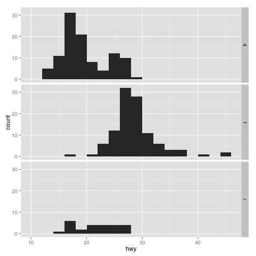

# Plotting System: ggplot 
ggplot --> Grammar of Graphics. Current version is ggplot2

## 1. qplot

```r
# Simple qplot
library(ggplot2)
str(mpg)
```

```
## 'data.frame':	234 obs. of  11 variables:
##  $ manufacturer: Factor w/ 15 levels "audi","chevrolet",..: 1 1 1 1 1 1 1 1 1 1 ...
##  $ model       : Factor w/ 38 levels "4runner 4wd",..: 2 2 2 2 2 2 2 3 3 3 ...
##  $ displ       : num  1.8 1.8 2 2 2.8 2.8 3.1 1.8 1.8 2 ...
##  $ year        : int  1999 1999 2008 2008 1999 1999 2008 1999 1999 2008 ...
##  $ cyl         : int  4 4 4 4 6 6 6 4 4 4 ...
##  $ trans       : Factor w/ 10 levels "auto(av)","auto(l3)",..: 4 9 10 1 4 9 1 9 4 10 ...
##  $ drv         : Factor w/ 3 levels "4","f","r": 2 2 2 2 2 2 2 1 1 1 ...
##  $ cty         : int  18 21 20 21 16 18 18 18 16 20 ...
##  $ hwy         : int  29 29 31 30 26 26 27 26 25 28 ...
##  $ fl          : Factor w/ 5 levels "c","d","e","p",..: 4 4 4 4 4 4 4 4 4 4 ...
##  $ class       : Factor w/ 7 levels "2seater","compact",..: 2 2 2 2 2 2 2 2 2 2 ...
```

```r
qplot(displ, hwy, data = mpg)
```

 

```r
# Add color to drv
qplot(displ, hwy, data = mpg, color = drv)
```

 

```r
# Add geom
qplot(displ, hwy, data = mpg, geom = c("point", "smooth"))
```

```
## geom_smooth: method="auto" and size of largest group is <1000, so using loess. Use 'method = x' to change the smoothing method.
```

 

```r
# Histogram
qplot(hwy, data = mpg, fill = drv)
```

```
## stat_bin: binwidth defaulted to range/30. Use 'binwidth = x' to adjust this.
```

 

```r
# Facets
qplot(displ, hwy, data  = mpg, facets = . ~ drv)
```

 

```r
qplot(hwy, data  = mpg, facets = drv ~ ., binwidth = 2)
```

 

```r
# Apply density
qplot(hwy, data  = mpg, geom ="density")
```

 

```r
# Differentiate drv by color
qplot(hwy, data  = mpg, geom ="density", color = drv)
```

 

```r
# Differentiate drv by shape
qplot(displ,hwy, data  = mpg, shape = drv)
```

 

```r
# Differentiate drv by color
qplot(displ,hwy, data  = mpg, color = drv)
```

 

```r
# Point and Smooth 
qplot(displ,hwy, data  = mpg, color = drv, geom = c("point", "smooth"))
```

```
## geom_smooth: method="auto" and size of largest group is <1000, so using loess. Use 'method = x' to change the smoothing method.
```

 

```r
# Smooth by linear regression
qplot(displ,hwy, data  = mpg, color = drv, geom = c("point", "smooth"), method = "lm")
```

 

```r
# Smooth by linear regression and appply facets
qplot(displ, hwy, data  = mpg, color = drv, geom = c("point", "smooth"), method = "lm", facets = .~drv)
```

 
## 1. ggplot
ggplot builds up the plot in layers
– Plot the data	
– Overla a summary	
– Metadata and annotation	

```r
head(mpg)
```

```
##   manufacturer model displ year cyl      trans drv cty hwy fl   class
## 1         audi    a4   1.8 1999   4   auto(l5)   f  18  29  p compact
## 2         audi    a4   1.8 1999   4 manual(m5)   f  21  29  p compact
## 3         audi    a4   2.0 2008   4 manual(m6)   f  20  31  p compact
## 4         audi    a4   2.0 2008   4   auto(av)   f  21  30  p compact
## 5         audi    a4   2.8 1999   6   auto(l5)   f  16  26  p compact
## 6         audi    a4   2.8 1999   6 manual(m5)   f  18  26  p compact
```

```r
g <- ggplot(mpg, aes(displ, hwy))
summary(g)
```

```
## data: manufacturer, model, displ, year, cyl, trans, drv, cty, hwy,
##   fl, class [234x11]
## mapping:  x = displ, y = hwy
## faceting: facet_null()
```

```r
# Plot after adding geom_points
p <- g + geom_point()
print(p)
```

 

```r
# OR
g + geom_point()
```

 

```r
# Add more layers: Smooth
g + geom_point() + geom_smooth()
```

```
## geom_smooth: method="auto" and size of largest group is <1000, so using loess. Use 'method = x' to change the smoothing method.
```

 

```r
# Smooth using linear regression
g + geom_point() + geom_smooth(method= "lm")
```

 

```r
# Add more layers: Facet
g + geom_point() + facet_grid(.~ drv) + geom_smooth(method= "lm")
```

 

```r
# Add themes (eg. theme_gray(), theme_bw())
g + geom_point() + facet_grid(.~ drv) + geom_smooth(method= "lm") + theme_bw()
```

 

```r
# Modifying aesthetics, constant value for color
g + geom_point(color = "steelblue", size = 4, alpha =  1/2)
```

 

```r
# Modifying aesthetics, data variable value for color
g + geom_point(aes(color = drv) , size = 4, alpha =  1/2)
```

 

```r
# Modifying labels
g + geom_point(aes(color = drv)) + labs(title = "Automobile Performance") + labs(x = "Engine displacement", y = "High way mileage")
```

 

```r
#Customizing the smooth
g + geom_point(aes(color = drv) , size = 4, alpha =  1/2) + geom_smooth(size = 4, linetype = 3, method = "lm", se = FALSE)
```

 

```r
#Changing the Theme with font
g + geom_point(aes(color = drv)) + theme_bw(base_family = "Times")
```

 

```r
# Generate .md file and figure folder
#library(knitr)
#library(markdown)
#knit("ggplot_system.Rmd")
```


