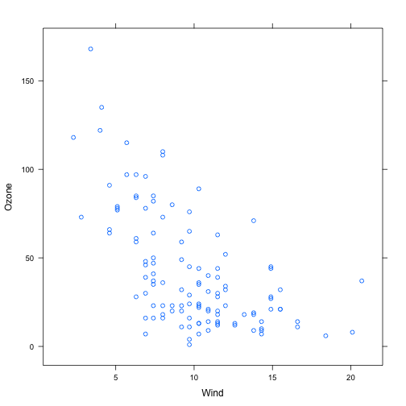
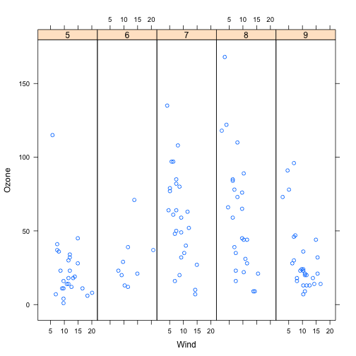

# Lattice Plotting System


```r
#Simple Lattice plot 1
library(datasets)
library(lattice)

##Simple scatter plot
xyplot(Ozone ~ Wind, data = airquality)
```

 

```r
#Simple Lattice plot 2
library(datasets)
library(lattice)

## Convert 'Month' to a factor variable
airquality <- transform(airquality, Month = factor(Month))
xyplot(Ozone ~ Wind | Month, data = airquality, layout = c(5, 1))
```

 

```r
## The system works by returning a graphic object Trellis and then printing it using the lattice functions
## for printing
p <- xyplot(Ozone ~ Wind, data = airquality)  ## Nothing happens!
print(p)  ## Plot appears
```

 

